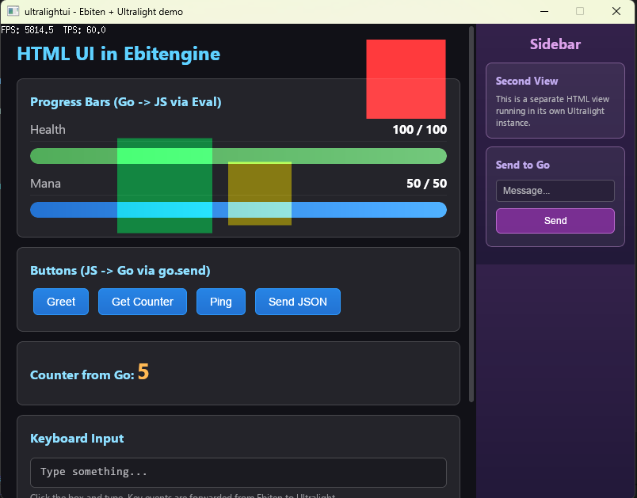

# ultralightui

Render HTML/CSS/JS interfaces as textures in [Ebitengine](https://ebitengine.org) using [Ultralight 1.4](https://ultralig.ht).

- Full HTML5/CSS3/JS engine rendered to an off-screen bitmap
- Transparent backgrounds (HTML layers on top of your game)
- Bidirectional Go <-> JavaScript communication via native JavaScriptCore bindings
- Multiple independent views with per-view input routing
- Mouse, scroll, and keyboard forwarding from Ebiten to Ultralight
- Embedded assets via VFS: bundle HTML/CSS/JS/images inside the binary with `go:embed`
- No CGo required (uses [purego](https://github.com/ebitengine/purego) + a small C bridge DLL)

## Architecture

```
Go (Ebitengine) <--purego--> ul_bridge shared lib (GCC) <--dlopen/LoadLibrary--> Ultralight 1.4 libs
```

The C bridge shared library (`ul_bridge.c`) runs all Ultralight API calls on a dedicated worker
thread (Ultralight requires single-thread affinity). Go communicates with it through simple
exported functions via purego. On Windows it uses Win32 APIs (`LoadLibrary`, `CreateThread`,
`CreateEvent`); on Linux/macOS it uses POSIX equivalents (`dlopen`, `pthread`, `pthread_cond`).

## Setup

### Prerequisites

| Tool | Version | What for |
|------|---------|----------|
| [Go](https://go.dev/dl/) | 1.21+ | Build your application |
| [Ebitengine](https://ebitengine.org) | v2.8+ | Game engine (pulled automatically by `go mod`) |
| GCC | Any | Compile the bridge shared library from source ([w64devkit](https://github.com/skeeto/w64devkit/releases) on Windows, system GCC on Linux/macOS) |
| [Ultralight SDK](https://ultralig.ht) | 1.4 | HTML rendering engine (download separately) |

### Step 1: Download the Ultralight 1.4 SDK

Go to [ultralig.ht/download](https://ultralig.ht/download/) (requires a free account) and download
the SDK for your platform (Windows x64, Linux x64, or macOS). Extract the archive. You'll get a folder like this:

```
ultralight-sdk/
  bin/
    Ultralight.dll / libUltralight.so / libUltralight.dylib
    UltralightCore.dll / libUltralightCore.so / libUltralightCore.dylib
    WebCore.dll / libWebCore.so / libWebCore.dylib
    AppCore.dll / libAppCore.so / libAppCore.dylib
  resources/
    cacert.pem
    icudt67l.dat        <-- ICU Unicode data (required for all text/JS)
  include/              <-- C headers (not needed at runtime)
  lib/                  <-- .lib/.a files (not needed, we load libs at runtime)
  ...
```

### Step 2: Copy SDK files to your project

Copy the SDK libraries and data files into the **working directory** of your application
(typically the folder where your `main.go` is, or wherever you run the executable from):

```bash
# From the SDK archive (use the files matching your platform):
cp ultralight-sdk/bin/*Ultralight*      your-project/
cp ultralight-sdk/bin/*UltralightCore*  your-project/
cp ultralight-sdk/bin/*WebCore*         your-project/
cp ultralight-sdk/bin/*AppCore*         your-project/
cp ultralight-sdk/resources/icudt67l.dat  your-project/
```

**SDK library names per platform:**

| Library | Windows | Linux | macOS |
|---------|---------|-------|-------|
| Ultralight | `Ultralight.dll` | `libUltralight.so` | `libUltralight.dylib` |
| UltralightCore | `UltralightCore.dll` | `libUltralightCore.so` | `libUltralightCore.dylib` |
| WebCore | `WebCore.dll` | `libWebCore.so` | `libWebCore.dylib` |
| AppCore | `AppCore.dll` | `libAppCore.so` | `libAppCore.dylib` |

**What each library does:**

| Library | Size | Purpose |
|---------|------|---------|
| Ultralight | ~1 MB | Core Ultralight API (renderer, views, surfaces) |
| UltralightCore | ~4 MB | Low-level rendering backend |
| WebCore | ~35 MB | HTML/CSS/JS engine (WebKit fork + JavaScriptCore) |
| AppCore | ~0.5 MB | Platform helpers (font loader, file system, logger) |
| `icudt67l.dat` | ~25 MB | [ICU](https://icu.unicode.org/) Unicode data tables. Required for all text rendering, JavaScript string operations, CSS text layout, regex, and locale-aware formatting. Without this file, Ultralight cannot process any text. |

### Step 3: Compile the bridge DLL

The bridge is a thin C layer between Go and Ultralight. The source is included in this
repository at [`bridge/ul_bridge.c`](bridge/ul_bridge.c). Compile it with GCC:

```bash
# Windows:
gcc -shared -o ul_bridge.dll bridge/ul_bridge.c -O2 -lkernel32

# Linux:
gcc -shared -fPIC -o libul_bridge.so bridge/ul_bridge.c -O2 -lpthread -ldl

# macOS:
gcc -shared -fPIC -o libul_bridge.dylib bridge/ul_bridge.c -O2 -lpthread -ldl
```

> **Windows tip**: If you don't have GCC in your PATH, download [w64devkit](https://github.com/skeeto/w64devkit/releases),
> extract it, and run from its shell. It's a single portable zip, no installer needed.

Place the resulting shared library in the same directory as the Ultralight SDK libraries.

### Step 4: Add the Go module

```bash
go get github.com/YindSoft/ultralight-ebitengine-port@latest
```

### Final directory layout

Your project directory should look like this:

```
your-project/
  main.go
  go.mod
  go.sum
  Ultralight.dll / libUltralight.so / libUltralight.dylib       \
  UltralightCore.dll / libUltralightCore.so / ...                 |  from Ultralight SDK
  WebCore.dll / libWebCore.so / ...                               |
  AppCore.dll / libAppCore.so / ...                               |
  icudt67l.dat                                                   /
  ul_bridge.dll / libul_bridge.so / libul_bridge.dylib   <-- compiled from bridge/ul_bridge.c
  ui/
    index.html            <-- your HTML interface
```

You can also place the libraries in a separate directory and pass it via `Options.BaseDir`.

## Quick Start

```go
package main

import (
    "fmt"
    ultralightui "github.com/YindSoft/ultralight-ebitengine-port"
    "github.com/hajimehoshi/ebiten/v2"
)

type Game struct {
    ui *ultralightui.UltralightUI
}

func (g *Game) Update() error { return g.ui.Update() }

func (g *Game) Draw(screen *ebiten.Image) {
    screen.DrawImage(g.ui.GetTexture(), nil)
}

func (g *Game) Layout(w, h int) (int, int) { return 800, 600 }

func main() {
    ui, err := ultralightui.NewFromFile(800, 600, "ui/index.html", nil)
    if err != nil {
        panic(err)
    }
    defer ui.Close()

    ui.OnMessage = func(msg string) {
        fmt.Println("from JS:", msg)
    }

    ebiten.SetWindowSize(800, 600)
    ebiten.RunGame(&Game{ui: ui})
}
```

## API

### Creating views

```go
// From a local HTML file (path relative to working directory):
ui, err := ultralightui.NewFromFile(width, height, "ui/index.html", nil)

// From raw HTML bytes:
ui, err := ultralightui.NewFromHTML(width, height, []byte("<h1>Hello</h1>"), nil)

// From a URL:
ui, err := ultralightui.NewFromURL(width, height, "https://example.com", nil)
```

### Options

```go
opts := &ultralightui.Options{
    BaseDir: "/path/to/libs",  // Where to find the bridge and SDK libraries (default: working dir)
    Debug:   true,             // Create bridge.log and ultralight.log for troubleshooting
}
ui, err := ultralightui.NewFromFile(800, 600, "ui/index.html", opts)
```

### JS -> Go (messages)

JavaScript sends messages to Go using `go.send()`:

```javascript
// Send a string
go.send("attack");

// Send JSON (receives as a JSON string on the Go side)
go.send(JSON.stringify({ action: "move", x: 10, y: 20 }));
```

Go receives messages via the `OnMessage` callback:

```go
ui.OnMessage = func(msg string) {
    // msg is "attack" or '{"action":"move","x":10,"y":20}'
    data, err := ultralightui.ParseMessage(msg) // auto-parses JSON
    fmt.Println(data)
}
```

This uses native JavaScriptCore bindings under the hood (no `console.log` hacks).

### Go -> JS (eval and send)

Run arbitrary JavaScript:

```go
ui.Eval("document.getElementById('score').textContent = '100'")
ui.Eval("updateHP(75, 100)") // call a JS function you defined
```

Send structured data (serialized as JSON):

```go
ui.Send(map[string]any{"hp": 80, "maxHp": 100, "items": []string{"sword", "shield"}})
```

JavaScript receives it via `go.receive`:

```javascript
go.receive = function(data) {
    console.log(data.hp, data.maxHp);   // 80 100
    console.log(data.items);            // ["sword", "shield"]
};
```

### Input

Mouse and scroll events are forwarded when the cursor is inside the view's bounds.
Keyboard events go to whichever view has focus.

```go
// Restrict this view to a screen region (for multi-view layouts):
ui.SetBounds(x, y, width, height)

// Give keyboard focus to this view:
ui.SetFocus()
```

Clicking inside a view automatically gives it focus.

### Multiple views

You can create multiple independent views, each with its own HTML page:

```go
mainUI, _ := ultralightui.NewFromFile(600, 400, "ui/main.html", nil)
sidebar, _ := ultralightui.NewFromFile(200, 400, "ui/sidebar.html", nil)

mainUI.SetBounds(0, 0, 600, 400)
sidebar.SetBounds(600, 0, 200, 400)
```

### Transparency

HTML views have transparent backgrounds by default. This lets you layer HTML on top
of your game rendering. Use CSS `background: rgba(...)` for semi-transparent panels.

## Embedded assets (VFS)

You can bundle all your HTML/CSS/JS/images inside the Go binary using `go:embed` and
the built-in virtual file system (VFS). No files need to exist on disk at runtime
(except the Ultralight SDK libraries and `icudt67l.dat`).

```go
package main

import (
    "embed"
    ultralightui "github.com/YindSoft/ultralight-ebitengine-port"
    "github.com/hajimehoshi/ebiten/v2"
)

//go:embed ui
var uiFiles embed.FS

type Game struct{ ui *ultralightui.UltralightUI }
func (g *Game) Update() error              { return g.ui.Update() }
func (g *Game) Draw(screen *ebiten.Image)  { screen.DrawImage(g.ui.GetTexture(), nil) }
func (g *Game) Layout(w, h int) (int, int) { return 800, 600 }

func main() {
    ui, err := ultralightui.NewFromFS(800, 600, "ui/index.html", uiFiles, nil)
    if err != nil { panic(err) }
    defer ui.Close()

    ebiten.SetWindowSize(800, 600)
    ebiten.RunGame(&Game{ui: ui})
}
```

### How it works

1. `go:embed ui` compiles the entire `ui/` folder into the binary
2. `NewFromFS` walks the embedded FS and registers every file in a C-level VFS via `RegisterFile()`
3. The VFS is checked first on every Ultralight file request; disk is used as fallback
4. The main page is loaded via `file:///ui/index.html` which resolves from the VFS
5. All relative references (`<link href="style.css">`, `<script src="app.js">`, etc.) resolve from the VFS too

### VFS API

You can also register individual files manually (useful for dynamic content):

```go
// Register files before creating views that reference them
ultralightui.RegisterFile("ui/config.json", configBytes)

// Query the number of registered files
count := ultralightui.VFSFileCount()

// Clear all registered files
ultralightui.ClearFiles()
```

## Examples

### Multi-view example



See the [`example/`](example/) directory for a complete working demo with two views,
animated Ebiten shapes behind HTML, bidirectional communication, and keyboard input.

```bash
cd example
go run .
```

### Embedded assets example

See the [`example_embed/`](example_embed/) directory for a demo that loads all
HTML/CSS/JS from `go:embed` with no files on disk. It demonstrates:

- Separate `.html`, `.css`, and `.js` files all served from the VFS
- Go -> JS communication (counter updates every second)
- JS -> Go communication (button clicks via `go.send()`)

```bash
cd example_embed
go run .
```

Both examples expect the SDK libraries to be in the parent directory (the repo root).

## How it works (internals)

1. The bridge shared library loads the Ultralight SDK at runtime via `LoadLibrary`/`GetProcAddress` (Windows) or `dlopen`/`dlsym` (Linux/macOS)
2. A dedicated worker thread handles all Ultralight API calls (renderer, views, JS eval)
3. Go sends commands to the worker thread via a simple command queue with platform-native synchronization (Win32 events on Windows, pthread mutex+cond on POSIX)
4. Pixel data is read from Ultralight's surface bitmap (BGRA), converted to RGBA, and written to an Ebiten image
5. JS -> Go communication uses JavaScriptCore's native C API (`JSObjectMakeFunctionWithCallback`) to register `window.go.send()` as a native function that pushes messages to a queue
6. Go -> JS communication calls `window.go.receive(data)` via `ulViewEvaluateScript`

## Troubleshooting

| Problem | Solution |
|---------|----------|
| `failed to load ul_bridge` | Make sure the bridge shared library (`ul_bridge.dll` / `libul_bridge.so` / `libul_bridge.dylib`) is in your working directory or in `Options.BaseDir`. Recompile it if needed. |
| `FAIL: Ultralight` / `FAIL: WebCore` in bridge.log | One of the SDK libraries is missing. Copy all 4 libraries from the SDK `bin/` folder. |
| All pixels are zero / blank screen | Make sure `icudt67l.dat` is present. Enable `Debug: true` and check `ultralight.log`. |
| Buttons don't respond to clicks | Verify `SetBounds()` matches where you draw the texture. Input is only forwarded inside bounds. |
| Keyboard doesn't work | Call `SetFocus()` on the view, or click inside it first. |

## Platform support

| Platform | Bridge library | SDK libraries | Status |
|----------|---------------|---------------|--------|
| Windows x64 | `ul_bridge.dll` | `*.dll` | Tested |
| Linux x64 | `libul_bridge.so` | `lib*.so` | Supported (requires Ultralight Linux SDK) |
| macOS x64/arm64 | `libul_bridge.dylib` | `lib*.dylib` | Supported (requires Ultralight macOS SDK) |

The C bridge uses `#ifdef _WIN32` to select between Win32 APIs and POSIX equivalents
(`dlopen`/`dlsym`, `pthread_create`, `pthread_mutex`/`pthread_cond`). The Go side uses
build tags (`bridge_windows.go`, `bridge_unix.go`) to select the library loading mechanism.

## License

[MIT](LICENSE) - Copyright (c) 2026 Javier Podavini (YindSoft)

Ultralight is a separate product with its own [license](https://ultralig.ht). The SDK DLLs
are **not** included in this repository; you must download them from the Ultralight website.
